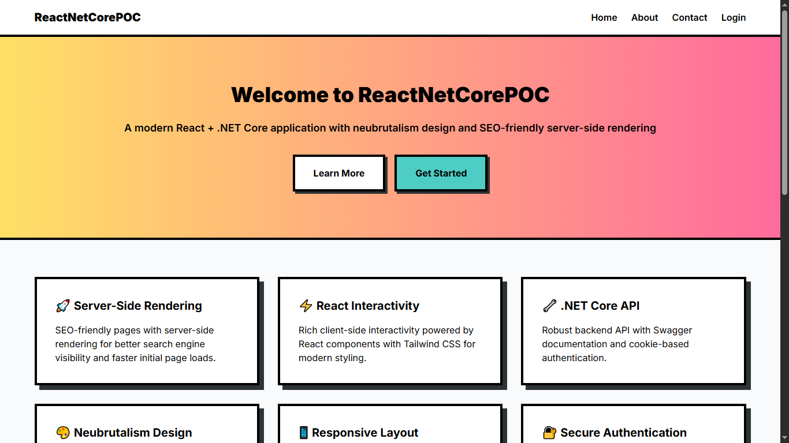
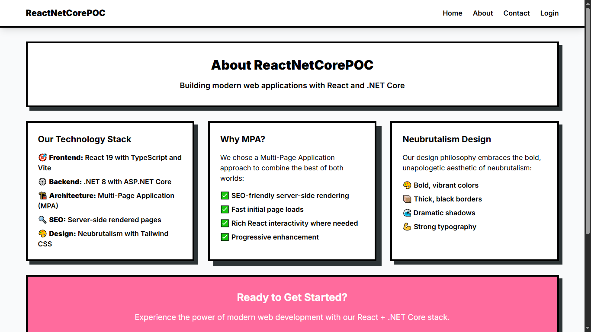
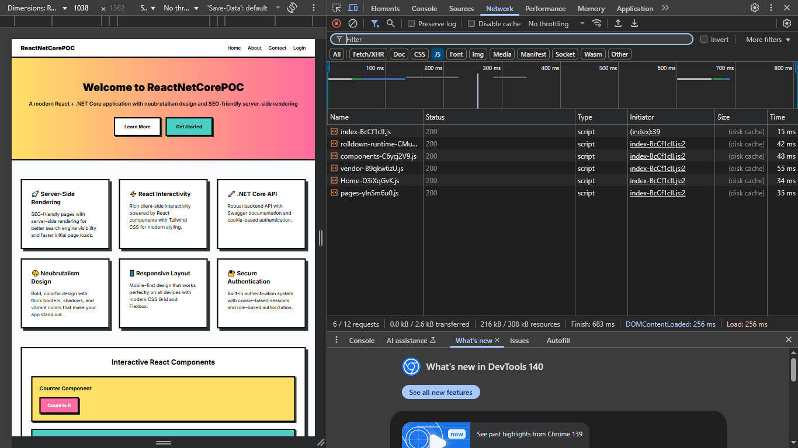

# ReactNetCorePOC

A modern **Multi-Page Application (MPA)** built with **React 19** and **.NET Core 8**, featuring **neubrutalism design** and **SEO-friendly server-side rendering**.


## 🎨 **Neubrutalism Design**

This project features a bold, vibrant design system with:

- **Thick black borders** and dramatic shadows
- **Vibrant color palette** (yellow, pink, blue, green, orange)
- **Strong typography** with Inter font
- **Bold, unapologetic aesthetic**

📸 **[View Design Proof & Screenshots](docs/design-proof/README.md)** - Visual documentation of the working application

## 📸 **Visual Documentation**

### **Design Screenshots**

#### Homepage Design


_Neubrutalism homepage with gradient hero section and feature cards_

#### About Page Design


_Technology stack showcase with three-column layout_

#### Contact Page Design


_Contact form with neubrutalism styling and contact information_

#### Login Page Design


_Authentication form with demo credentials section_

### **JavaScript Loading Analysis**

#### Home Route JS Loading


_Network tab showing JS loading for home route_

#### About Route JS Loading


_Network tab showing JS loading for about route_

#### Contact Route JS Loading


_Network tab showing JS loading for contact route_

#### Login Route JS Loading


_Network tab showing JS loading for login route_

### **Key Features Demonstrated**

✅ **Neubrutalism Design Implementation** - Bold colors, thick borders, dramatic shadows  
✅ **Route-Specific JavaScript Loading** - Efficient modular loading per route  
✅ **Performance Optimization** - 304 Not Modified responses, fast loading times  
✅ **Responsive Design** - Mobile-first approach with Tailwind CSS  
✅ **Interactive Components** - React state management and dynamic content  
✅ **Optimized Text Scaling** - Improved readability at 100% zoom with reduced text sizes

## 🏗️ **Architecture**

- **Multi-Page Application (MPA)** for SEO optimization
- **Server-side rendering** with ASP.NET Core MVC
- **React components** render ENTIRE pages (not just small parts)
- **Cookie-based authentication** system
- **RESTful API** with Swagger documentation

## 🚀 **Quick Start**

### Prerequisites

- **.NET 8 SDK** ([Download](https://dotnet.microsoft.com/download/dotnet/8.0))
- **Node.js 18+** ([Download](https://nodejs.org/))
- **npm** (comes with Node.js)
- **Git** ([Download](https://git-scm.com/))

### 1. Clone the Repository

```bash
git clone <repository-url>
cd ReactNetCorePOC
```

### 2. Install Dependencies

#### Backend (.NET Core)

```bash
cd ReactNetCorePOC.Server
dotnet restore
```

#### Frontend (React)

```bash
cd reactnetcorepoc.client
npm install
```

### 3. Run Development Server

#### **Method 1: Production Build (Recommended)**

**Option A: Manual Commands**

```bash
# Build React app first (generates manifest automatically)
cd reactnetcorepoc.client
npm run build

# Copy built files to server
cd ../ReactNetCorePOC.Server
Copy-Item ..\reactnetcorepoc.client\dist\* wwwroot\ -Recurse -Force

# Run .NET server (serves built React app)
dotnet run
```

**Option B: PowerShell Script**

```powershell
# Create and run build.ps1
@"
cd reactnetcorepoc.client
npm run build
cd ../ReactNetCorePOC.Server
Copy-Item ..\reactnetcorepoc.client\dist\* wwwroot\ -Recurse -Force
dotnet run
"@ | Out-File -FilePath build.ps1 -Encoding UTF8
.\build.ps1
```

**Option C: Shell Script (Linux/Mac)**

```bash
# Create and run build.sh
cat > build.sh << 'EOF'
#!/bin/bash
cd reactnetcorepoc.client
npm run build
cd ../ReactNetCorePOC.Server
cp -r ../reactnetcorepoc.client/dist/* wwwroot/
dotnet run
EOF
chmod +x build.sh
./build.sh
```

#### **Method 2: Development with Hot Reload**

**Option A: Manual Commands**

```bash
# Terminal 1: Start React dev server with hot reload
cd reactnetcorepoc.client
npm run dev

# Terminal 2: Start .NET server
cd ReactNetCorePOC.Server
dotnet run
```

**Option B: PowerShell Script**

```powershell
# Create and run dev.ps1
@"
# Start React dev server in background
Start-Process powershell -ArgumentList "-NoExit", "-Command", "cd reactnetcorepoc.client; npm run dev"
# Start .NET server
cd ReactNetCorePOC.Server
dotnet run
"@ | Out-File -FilePath dev.ps1 -Encoding UTF8
.\dev.ps1
```

**Option C: Shell Script (Linux/Mac)**

```bash
# Create and run dev.sh
cat > dev.sh << 'EOF'
#!/bin/bash
# Start React dev server in background
cd reactnetcorepoc.client
npm run dev &
# Start .NET server
cd ../ReactNetCorePOC.Server
dotnet run
EOF
chmod +x dev.sh
./dev.sh
```

**Note**: For development with hot reload, the React dev server runs on `http://localhost:5173` and the .NET server on `http://localhost:5104`. The .NET server will serve the React dev server for hot reload functionality.

### 4. Access the Application

- **Home**: `http://localhost:5104/`
- **About**: `http://localhost:5104/Home/About`
- **Contact**: `http://localhost:5104/Home/Contact`
- **Login**: `http://localhost:5104/Account/Login`
- **Dashboard**: `http://localhost:5104/Dashboard` (after login)
- **API Documentation**: `http://localhost:5104/swagger`

## 🔐 **Authentication**

### Demo Credentials

- **Email**: `admin@example.com`
- **Password**: `P@ssword1234!`

## 🛠️ **Development Setup**

### **React-First Architecture**

This is a **React-first MPA** where:

- **Each page is a complete React component**
- **CSHTML files only contain `<div id="react-root"></div>`**
- **React takes over the entire page rendering**
- **No mixing of CSHTML and React content**

### **Project Structure**

```
ReactNetCorePOC/
├── ReactNetCorePOC.Server/          # .NET Core Backend
│   ├── Controllers/                  # MVC Controllers
│   ├── Views/                        # CSHTML files (just divs)
│   └── wwwroot/                      # Static files
└── reactnetcorepoc.client/           # React Frontend
    ├── src/
    │   ├── pages/                    # Complete React pages
    │   │   ├── Home.tsx
    │   │   ├── About.tsx
    │   │   ├── Contact.tsx
    │   │   ├── Login.tsx
    │   │   └── Dashboard.tsx
    │   ├── App.tsx                   # Router
    │   └── main.tsx                  # Entry point
    └── package.json
```

### **Development Workflow**

#### **Hot Reload Development**

**Option A: Manual Commands**

```bash
# Terminal 1: React dev server (hot reload)
cd reactnetcorepoc.client
npm run dev

# Terminal 2: .NET server
cd ReactNetCorePOC.Server
dotnet run
```

**Option B: PowerShell Script**

```powershell
# Create and run dev.ps1
@"
# Start React dev server in background
Start-Process powershell -ArgumentList "-NoExit", "-Command", "cd reactnetcorepoc.client; npm run dev"
# Start .NET server
cd ReactNetCorePOC.Server
dotnet run
"@ | Out-File -FilePath dev.ps1 -Encoding UTF8
.\dev.ps1
```

**Option C: Shell Script (Linux/Mac)**

```bash
# Create and run dev.sh
cat > dev.sh << 'EOF'
#!/bin/bash
# Start React dev server in background
cd reactnetcorepoc.client
npm run dev &
# Start .NET server
cd ../ReactNetCorePOC.Server
dotnet run
EOF
chmod +x dev.sh
./dev.sh
```

#### **Production Development**

**Option A: Manual Commands**

```bash
# Build React app (generates manifest automatically)
cd reactnetcorepoc.client
npm run build

# Copy built files to server
cd ../ReactNetCorePOC.Server
Copy-Item ..\reactnetcorepoc.client\dist\* wwwroot\ -Recurse -Force

# Run .NET server
dotnet run
```

**Option B: PowerShell Script**

```powershell
# Create and run build.ps1
@"
cd reactnetcorepoc.client
npm run build
cd ../ReactNetCorePOC.Server
Copy-Item ..\reactnetcorepoc.client\dist\* wwwroot\ -Recurse -Force
dotnet run
"@ | Out-File -FilePath build.ps1 -Encoding UTF8
.\build.ps1
```

**Option C: Shell Script (Linux/Mac)**

```bash
# Create and run build.sh
cat > build.sh << 'EOF'
#!/bin/bash
cd reactnetcorepoc.client
npm run build
cd ../ReactNetCorePOC.Server
cp -r ../reactnetcorepoc.client/dist/* wwwroot/
dotnet run
EOF
chmod +x build.sh
./build.sh
```

### **React Pages**

Each page is a complete React component:

- **`Home.tsx`** - Home page with hero section, features, and interactive components
- **`About.tsx`** - About page with technology stack and company info
- **`Contact.tsx`** - Contact page with form and contact information
- **`Login.tsx`** - Login page with authentication form
- **`Dashboard.tsx`** - Dashboard page with stats and interactive elements

### **Routing**

The app uses simple client-side routing in `App.tsx`:

```typescript
const path = window.location.pathname;

if (path === "/Home/About" || path === "/About") {
  return <About />;
}

if (path === "/Home/Contact" || path === "/Contact") {
  return <Contact />;
}

if (path === "/Account/Login" || path === "/Login") {
  return <Login />;
}

if (path === "/Dashboard") {
  return <Dashboard />;
}

// Default to Home page
return <Home />;
```

## 🏭 **Production Build**

### 1. Build React App

**Option A: Manual Commands**

```bash
cd reactnetcorepoc.client
npm run build
```

**Option B: PowerShell Script**

```powershell
# Create and run build.ps1
@"
cd reactnetcorepoc.client
npm run build
"@ | Out-File -FilePath build.ps1 -Encoding UTF8
.\build.ps1
```

**Option C: Shell Script (Linux/Mac)**

```bash
# Create and run build.sh
cat > build.sh << 'EOF'
#!/bin/bash
cd reactnetcorepoc.client
npm run build
EOF
chmod +x build.sh
./build.sh
```

This creates optimized production files in the `dist/` directory and generates a manifest file automatically.

### 2. Copy Built Files to Server

**Option A: Manual Commands**

```bash
cd ../ReactNetCorePOC.Server
Copy-Item ..\reactnetcorepoc.client\dist\* wwwroot\ -Recurse -Force
```

**Option B: PowerShell Script**

```powershell
# Create and run copy.ps1
@"
cd ReactNetCorePOC.Server
Copy-Item ..\reactnetcorepoc.client\dist\* wwwroot\ -Recurse -Force
"@ | Out-File -FilePath copy.ps1 -Encoding UTF8
.\copy.ps1
```

**Option C: Shell Script (Linux/Mac)**

```bash
# Create and run copy.sh
cat > copy.sh << 'EOF'
#!/bin/bash
cd ReactNetCorePOC.Server
cp -r ../reactnetcorepoc.client/dist/* wwwroot/
EOF
chmod +x copy.sh
./copy.sh
```

### 3. Build .NET Backend

```bash
dotnet publish -c Release -o ./publish
```

### 4. Run Production

```bash
cd publish
dotnet ReactNetCorePOC.Server.dll
```

## 🔧 **Configuration**

### **Development Settings**

#### **React Development**

- **Vite** for fast development server
- **Tailwind CSS** for styling
- **TypeScript** for type safety
- **Hot reload** for instant updates

#### **.NET Development**

- **MVC Controllers** for routing
- **Static file serving** for React build
- **Cookie authentication** for security
- **Swagger** for API documentation

### **Production Settings**

#### **Performance Optimizations**

- **Static file caching** with proper headers
- **Gzip compression** enabled
- **Minified CSS/JS** in production
- **CDN integration** for static assets

## 🧪 **Testing**

### **React Testing**

```bash
cd reactnetcorepoc.client
npm test
```

### **.NET Testing**

```bash
cd ReactNetCorePOC.Server
dotnet test
```

## 🚀 **Performance Optimization**

### **React Optimizations**

- **Automatic asset manifest** generation for cache busting
- **Code splitting** with React.lazy()
- **Image optimization** with WebP format
- **Bundle analysis** with webpack-bundle-analyzer
- **Tree shaking** for unused code removal

### **.NET Optimizations**

- **Response caching** for static content
- **Database connection pooling**
- **Async/await** patterns
- **Memory management** best practices

## 🔒 **Security Best Practices**

### **Authentication**

- **Strong password policies**
- **Account lockout** after failed attempts
- **Session timeout** configuration
- **Cookie-based authentication**

### **Data Protection**

- **HTTPS everywhere** in production
- **Input validation** and sanitization
- **XSS protection** headers
- **CSRF protection** with tokens

## 📱 **Mobile Responsiveness**

The application is fully responsive with:

- **Mobile-first design** approach
- **Touch-friendly** interface elements
- **Adaptive layouts** for all screen sizes
- **Progressive Web App** capabilities

## 🌐 **Browser Support**

- **Chrome** 90+
- **Firefox** 88+
- **Safari** 14+
- **Edge** 90+

## 🤝 **Contributing**

1. **Fork** the repository
2. **Create** a feature branch (`git checkout -b feature/amazing-feature`)
3. **Commit** your changes (`git commit -m 'Add amazing feature'`)
4. **Push** to the branch (`git push origin feature/amazing-feature`)
5. **Open** a Pull Request

## 📝 **License**

This project is licensed under the MIT License - see the [LICENSE](LICENSE) file for details.

## 🆘 **Troubleshooting**

### **Common Issues**

#### **PowerShell Execution Policy**

```bash
Set-ExecutionPolicy -ExecutionPolicy RemoteSigned -Scope CurrentUser
```

#### **Port Already in Use**

```bash
# Find and kill process using port
netstat -ano | findstr :5104
taskkill /PID <PID> /F
```

#### **Node Modules Issues**

```bash
# Clear npm cache
npm cache clean --force
rm -rf node_modules package-lock.json
npm install
```

#### **.NET Build Issues**

```bash
# Clean and rebuild
dotnet clean
dotnet restore
dotnet build
```

### **Getting Help**

- **Issues**: [GitHub Issues](https://github.com/your-repo/issues)
- **Discussions**: [GitHub Discussions](https://github.com/your-repo/discussions)
- **Documentation**: [Wiki](https://github.com/your-repo/wiki)

## 🎯 **Roadmap**

- [ ] **Real-time features** with SignalR
- [ ] **Database integration** with Entity Framework
- [ ] **Advanced authentication** with OAuth
- [ ] **Mobile app** with React Native
- [ ] **Microservices architecture** migration
- [ ] **Kubernetes deployment** configuration

---

**Built with ❤️ using React, .NET Core, and Neubrutalism Design**
